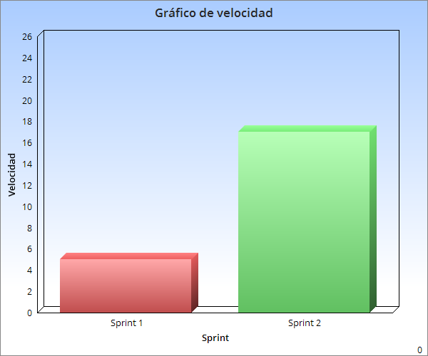

## Sprint 2:

Tareas a entregar: 

    Testeo del modelo base del proyecto (3).
	
	Crear set de peliculas dummys (3)

	Levantar API REST. Spring Boot (8). 8 de complejidad ya que requiere muchas horas de research.
    
	Levantar Server React(3) - Terminado
	

Estimacion para proximo sprint:

	Spike (2) (Get, Post) - PING
	
	Levantar set de Peliculas (2).

	Que el web server responda al set de peliculas (5).
    
    Conectar base de datos en el modelo(3)

Estado de servidor de integracion continua:
 
	--No hay tests. Pero esta conectado.

Velocidad sprint 2:

  

Retrospectiva del sprint:

	Highs = No hubo

	Lows = 

	

	

	
