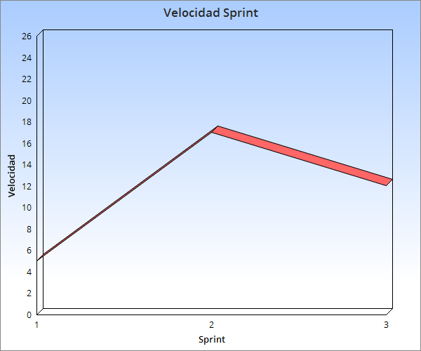

## Sprint 2:

Tareas a entregar: 

        Spike (2) (Get, Post) - PING
	
        Levantar set de Peliculas (2).

        Que el web server responda al set de peliculas (5).
    
        Conectar base de datos en el modelo(3)

Estimacion para proximo sprint:

	-Implementar DAOS(3)

	-Testear base de datos(5)

	-Refactor modelo (2)

	-
	

Estado de servidor de integracion continua:
 
	Funcionando.

Velocidad sprint:

  

Retrospectiva del sprint:

	Highs = No hubo

	Lows = Problemas con las build de intellij retrasaron el progreso.

	

	

	
