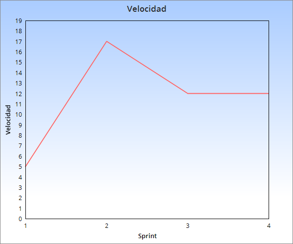

## Sprint 3:

Tareas a entregar: 

       -Post (2)
	
	-Que el web server responda a una pelicula (5).

	-Guardar las reservas en base de datos (5).

Estimacion para proximo sprint:

	-Pantalla de detalle pelicula (5)

	-Pantalla de reserva (5)
	

Estado de servidor de integracion continua:
 
	Funcionando.

Velocidad sprint:

  

Retrospectiva del sprint:

	Highs = Issues y projects para la division de tareas.

	Lows = No hubo.

	

	

	
