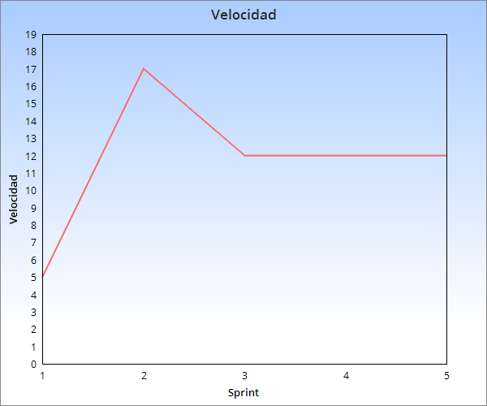

## Sprint 5:

Tareas a entregar: 

    -Pantalla de detalle pelicula (5).

	-Get recupera valor de base de datos (2).
	
	-Post impacta la base de datos (3).
	
	-Cambios en el modelo y manejo de excepciones (2).

Estimacion para proximo sprint:

    -Pantalla de reserva(5).

    -Envio de email con confirmacion de reserva(8).

    -Conectar modelo y web(5).
	

Estado de servidor de integracion continua:
 
	Funcionando.

Velocidad sprint:

  

Retrospectiva del sprint:

	Highs = No hubo
	Lows = No hubo

	

	

	
