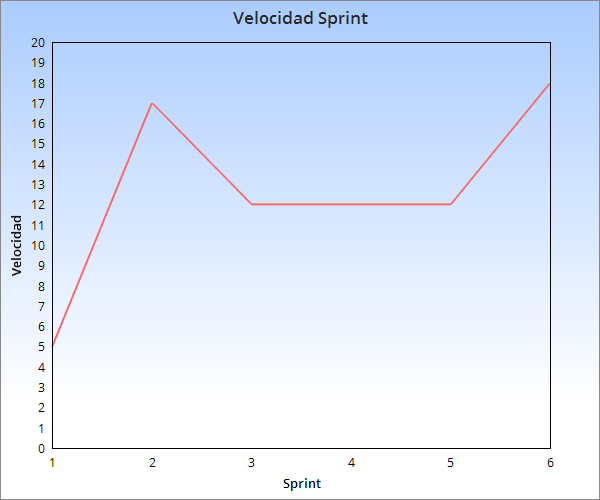

## Sprint 6:

Tareas a entregar: 
  
    -Pantalla de reserva(5).

    -Envio de email con confirmacion de reserva(8).

    -Conectar modelo y web(5).
	

Estimacion para proximo sprint:

    -Poder reservar desde la web (5) (Reserva funcionando desde postman)
    
    -Pantalla agregar pelicula (5)
	 
    -Pantalla remover pelicula (3)

    -Presentacion final del proyecto(3).

    -Mostrar solamente Funciones de Peliculas que tengan asientos disponibles(5).

Estado de servidor de integracion continua:
 
	Funcionando.
Velocidad sprint:

  

Retrospectiva del sprint:

	Highs = A base de leer documentacion de SpringBoot se encotraron soluciones sencillas a problemas grandes. 
 	Lows  = Problemas con compatibilidad del proyecto enlentecieron el avance.

	

	

	
